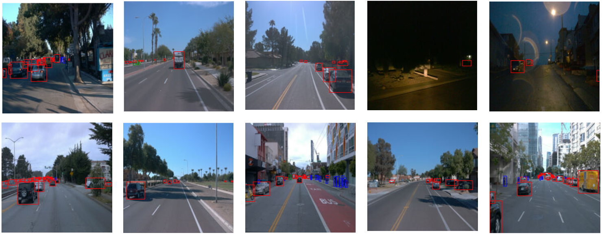
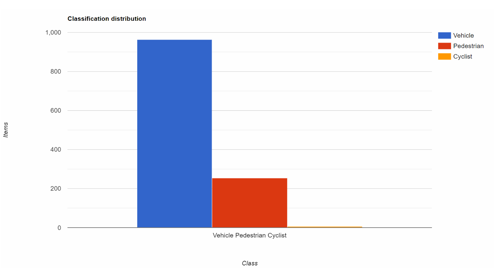
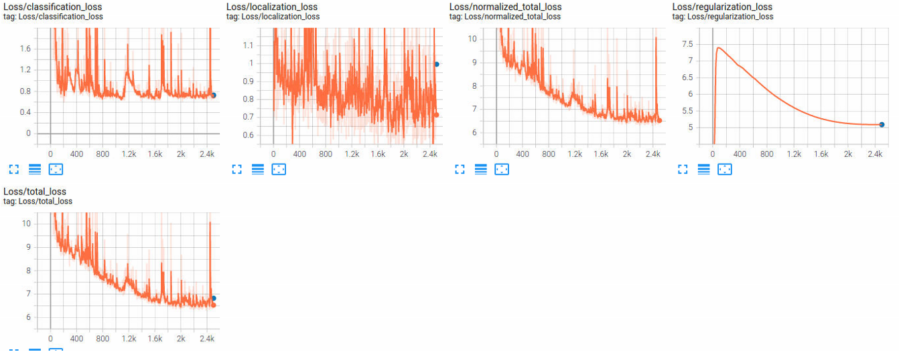
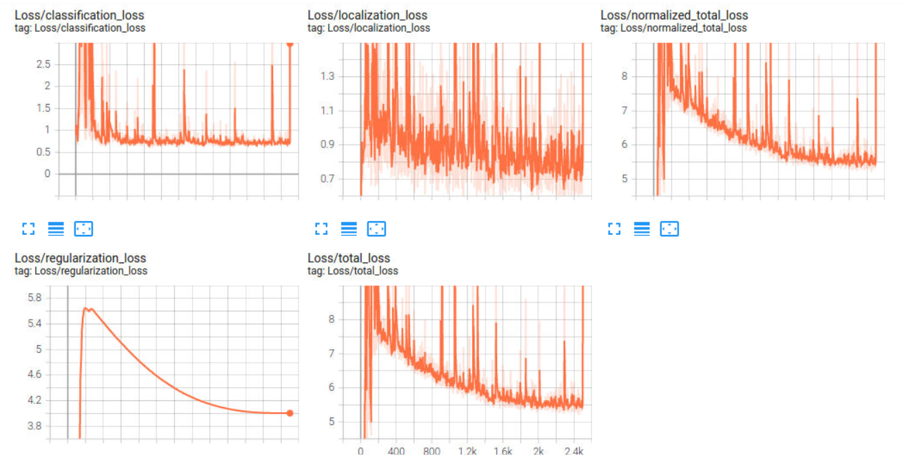
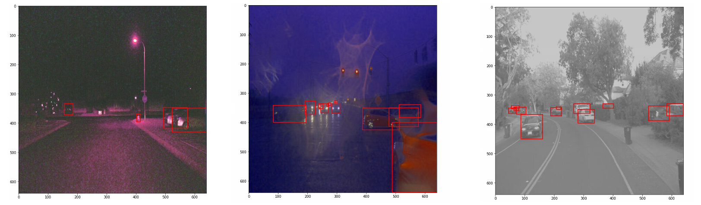
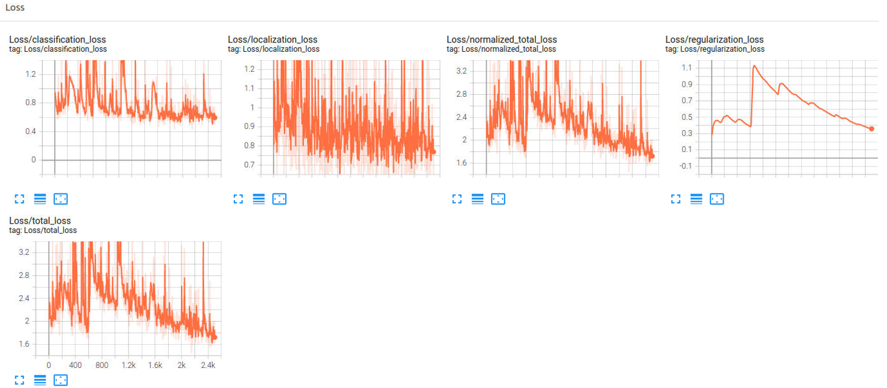
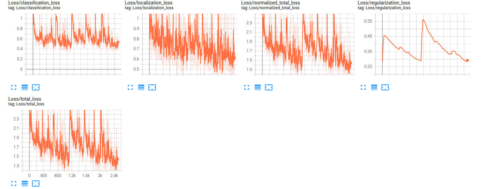

# Object Detection Project
In this project it was created a CNN to detect and classify objects using data from Waymo dataset and a SSD Resnet 50 640x640 model. At first some exploratory data analysis has been performed on the image batch  (Exploratory Data Analysis notebook), then the model has been trained and evaluated.

The projects contains all the requested files plus a "Object_Deteciotn.pdf" with the analysis on project results. N.B. there're two different .config files, the provided one and the modified one used for the various augmentation trials (it contains the last trial)
## Structure
### Data
The data is organized as follow:
```
/home/workspace/data/
    - train: contain the train data
    - val: contain the val data
    - test - contains files to test the model and create inference videos
```
### Experiments
The experiments folder is organized as follow:
```
experiments/
    - pretrained_model/
    - exporter_main_v2.py - to create an inference model
    - model_main_tf2.py - to launch training
    - reference/ - reference training with the unchanged config file, the modified config file and all checkpoints and tfevent from the training and evaluation phase
    - label_map.pbtxt
    ...
```
## Prerequisites
For the project is was used the on-line Project Workspace - Jupyter Notebooks

## Project Overview
### Dataset
Dataset has various street images which includes vehicles, pedestrians and cyclists. Images were taken in the variou weather, time condition as you can see below. (vehicles in red, pedestrians in blue, cyclist in green)

And I randomly selected 50 images and calculated the distribution of labels like below.

## Training
### Reference experiment
The following image show the result of the training process (the reference pipeline file is here [pipeline_new.config](Experiments/Reference/pipeline_new_augm.config)).



'forse dire che la eval non trova nessun oggetto'
In the following experiments I'll try to improve the performance.

## Improve on the reference

### Experiment on augmentation

After several tries, I was able to slightly improve performances with a combination on the following augment options in [pipeline_new_augm.config](Experiments/Exp_Augmentation/pipeline_new_augm.config)

```
  data_augmentation_options {
      random_rgb_to_gray {
        probability: 0.3
      }
  }
  data_augmentation_options {
      random_distort_color {
        color_ordering: 1
      }
  }
  data_augmentation_options {
      random_adjust_brightness {
        max_delta: 0.4
      }
  }
  data_augmentation_options {
      random_adjust_contrast {
        min_delta: 0.8
        max_delta: 1.25
      }
  }
  data_augmentation_options {
      random_adjust_hue {
        max_delta: 0.04
      }
  }
  data_augmentation_options {
      random_adjust_saturation {
        min_delta: 0.8
        max_delta: 1.25
      }
  }
```

Those data augment could added more samples for cloudy or night scenes and it clearly help reducing the loss.

And the result loss is like below.



Here some examples of augmented images:


### Experiment on optimization #1
Here's the pipeline config for this experiment: [pipeline_new_opt.config](Experiments/Exp_Oprimization/pipeline_new_opt.config)

At the final experiment, I have focused on reducing the loss at the later part of training and added decaying of learning rate like below.

```
  optimizer {
    adam_optimizer {
      learning_rate {
        exponential_decay_learning_rate {
          initial_learning_rate: 0.001
          decay_steps: 700
        }
      }
    }
    use_moving_average: false
  }
```

And it finally shows a real progress on loss and AP like below. (The orange lines indicate numbers from the new model)



### Experiment on optimization #2
Here's the pipeline config for this experiment: [pipeline_new_opt2.config](Experiments/Exp_Optimization2/pipeline_new_opt2.config)

I've tried a different optimization to see if the result can improve.

```
  optimizer {
    adam_optimizer {
      learning_rate {
        constant_learning_rate {
          learning_rate: 0.001
        }
      }
    }
    use_moving_average: false
  }
```

The total loss wasn't that improved much at the end and AP was not very good this time. (The purple lines indicate numbers from the new model)
But it was quite stable at the initial and middle part of epochs.



